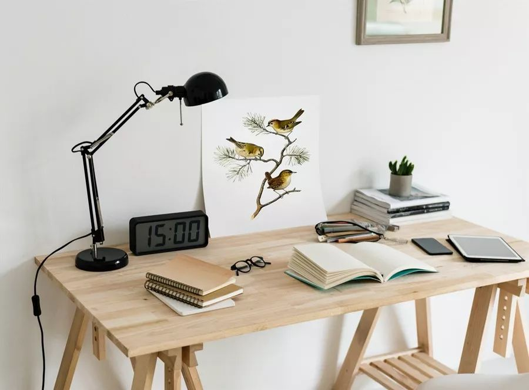
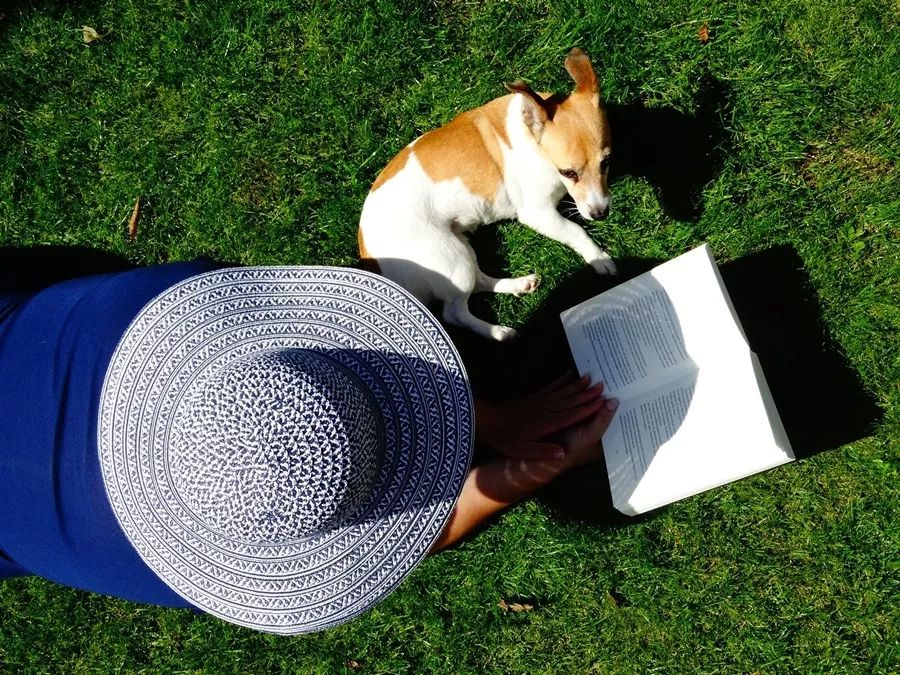
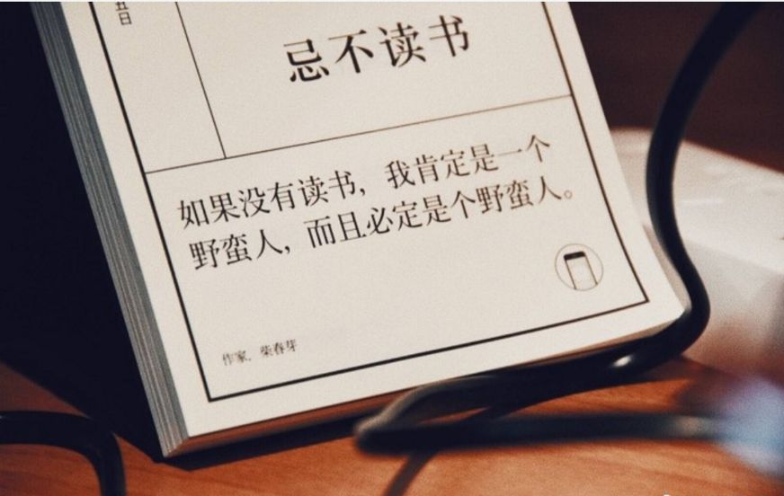
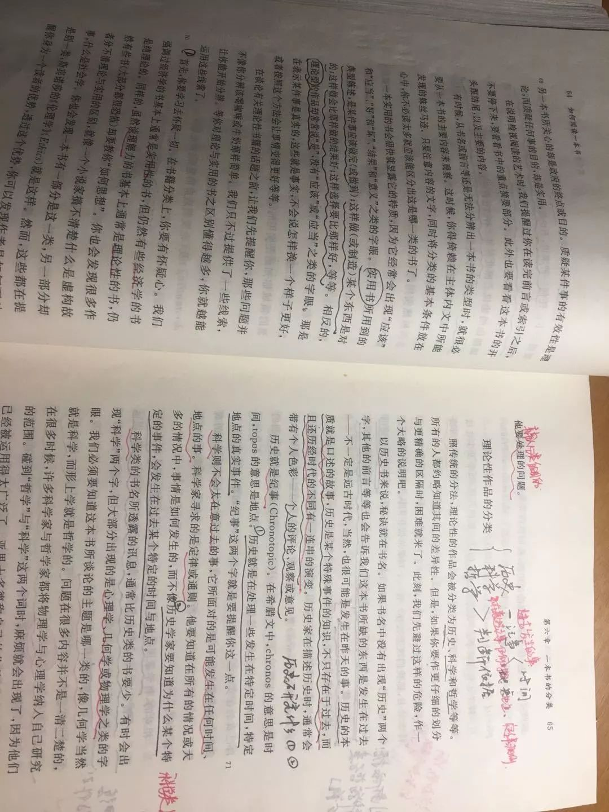
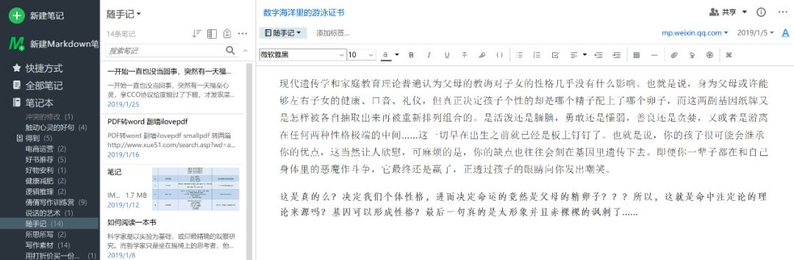

# BookReading
my articles about reading and watching

### 假期读书指南|如何阅读之先导篇

> 首发于公众号:pinkxixi-mj

> GitHub:EveryMeng

最近同学和朋友们陆续回到家，于是大家开启了疯狂吐槽爸妈模式，在家各种被嫌弃、花式被控诉，顿觉已然身入苦海，生无可恋。

我也没能逃过此劫，但逐渐发现，每当我读书时父母的唠叨就停止了，在他们眼中读书学习是可以顶替一切缺点的行为。最起码他们知道我在学习，而打扰我学习就是不正确的事。“知识改变命运”是大部分父母都信奉为“真理”的观念。

另外，利用假期多读书还有如下诸多优点：

* 	**充足的整块时间阅读心仪的长篇书籍**
* 	**充足时间做笔记**
* 	**代替无效社交，与大师对话**
* 	**默默努力赶超同学同事不是梦**
* 	**读书自学加分技能，技多不压身**

生活在信息时代，知识更新迭代不断加速，我们必须要形成一种“终身学习、时刻阅读”的观念，否则，这个时代就会抛弃你。都讲“**读书是性价比最高的学习方式**”，真的是这样。

“工欲善其事必先利其器”。明白了读书的必要性，是不是要马上拎起一本书开读？

Nonono，欲速则不达。

我们不管做什么事，都必须遵循【方法先行】的原则，掌握了读书的正确方法，就如同掌握整个行动最本质最基本的机理，我们便可“磨刀不误砍柴工”，达到事半功倍的效果。

以下所讲的方法，主要引用《如何阅读一本书》中的观点，加上自己读书的思考，希望对你有所帮助。

它的方法系统且实用，如果你也一直疑惑如何快速阅读与高效阅读，羡慕一年阅读书目的数量轻松达至50+的大V，并且没有适当的条件慢慢阅读这本书。那么我希望我的阅读笔记与思考，可以为你带去一些干货与启发。

##### 一、读书的目的

每当我们开始做一件事时，首先需要明确自己的目的，带着目标去行动，往往不容易偏离航道。作者将读书的目标分为两类：

**1、掌握新的资讯。
2、加强理解力。**

**第一种目的，举个例子——付费阅读**。它是帮助没有时间、没有能力去挖掘新知识的消费者，将隐藏在书海中的、晦涩难懂但金光闪闪的知识以简单明了的语言整理和呈现出来，抚慰现代社会浮躁却又跟风读书的年轻人那种可无法学习新知识的焦虑感。

他们的需求就是在短时间内，看懂新知识，掌握新资讯，获得已经得到新知识的安全感。这就是罗胖的付费阅读之所以拥有海量粉丝的原因。他们已经不敢（或者压根没有意识）或再对自己产生更高要求，也就是第二种目的——加强理解力。

经过一天忙碌的、疲惫的工作碾压后，还要完成“学习”这个“费心费脑”的动作，实在太“强人所难”了。也可以理解，毕竟，那些在职准备考研、考博的人都很辛苦。

说明一点，这里对第一个目的没有任何贬低的意思。两种目的的选择和具体工作有关。

比如，我要写一份竞品分析报告，那么我首先就要收集各同行产品的业务报告，并对其进行梳理。在这里，就要用到第一种读书方式——掌握新资讯。我们要了解同行当下的发展现状，掌握最新讯息，收集近期数据分析前沿趋势。那么，第二种加强理解力的阅读，这才是真正的“阅读”。

**加强理解力的阅读**，通常是这种情况：作者和读者一开始不相等的理解程度，但读者这种不相等的理解力又被克服在一定的范围之内。所以，在阅读的过程中，我们要想方设法达到和作者相同的理解力，才能完满理解作者所表之意。

这也就能解释，为什么经典名著第一遍总是读不懂，通常要二刷三刷甚至N刷。

在一遍遍重读的过程中，如果你还能够做到“凭借着头脑的运作，除了玩味读物中的一些字句外，不假任何外助，以一己之力来提升自我”，那么，一定要恭喜你，你已经成功地运用了“阅读的艺术”。

### 二、阅读的四层次

阅读分为四个层次，按照由浅入深的程度依次是：

**1、基础阅读
2、检视阅读
3、分析阅读
4、主题阅读**

基础阅读:

最终可以消化他学到的阅读经验，并将其运用到阅读所有读物过程中，按作者的观点，最迟在初中毕业时每个学生就该牢牢掌握。

然而，遗憾的是，我国大多数初中毕业生甚至高中毕业生都没有达到这个水平，因为他们根本没有意识到此项能力的培养，一直忽略“阅读”这一重要的、基本的能力，同“写作”能力一样。

检视阅读

分为两层次：有系统的略读、粗浅的略读。

**有系统的略读**，需要我们依次读到：序，副标题，目录，索引，最后两三页（往往总结全文，强调核心主旨或论点）等。这步需要我们花费多长时间，只是如同会见一位陌生人一样，我们肯定会先从头到脚搂一眼，就能初步判断这个人是个什么样的性格了。

在“检视阅读二：**粗浅的阅读**”这一章作者说到，我们小时总被老师教导在读书时如果碰到生僻字，就停下来查字典，一直持续到读完全文。作者批评说这种读书方式是错误的。

记得在上初中时，语文课本有许多古文，甚至是一些经典的现代文。但我从来都是用老师交给我的方法去阅读，尤其是古文里的生僻字词，导致当时的我觉得课本读起来索然无味，所以从来没有喜欢过教材上的什么文章，更也不会主动去读教材。

那时候我同桌（语文第一）总是在学期初就把语文教材甚至选修读本都提前读完，我心里暗赞这太牛了，现在想想，可能只不过是他运用了正确的阅读方法。

实话说，书里教导的，在读一本难度的书时，略过那些不懂的部分，集中精力在读懂的部分这个方法，我是最近一个月才自己慢慢摸索出来的。

就在我读专业课程老师推荐的阅读书目《社会参考理论》时，作者是基于19世纪美国士兵的调查进行的研究阐释，前两页读完后，我根本就不知道作者在讲什么.

但我硬是硬着头皮读了下去，自行就跳过那些读不懂的部分，去理解那些读得懂的段落。一遍过下来，再回头看开头的两段时，竟然理解了作者的意思。

**检视阅读的一个重要规则：在第一次阅读一本难读的书时，不要企图了解每一个字句。先快快地读一遍，第二遍才是真正开始阅读这本书**。

我深以为然，并在这里专门引用出来，与大家共勉。

### 三、主动阅读的基础

再往下进行的分析阅读和主题阅读则属于深入阅读。

若想进行更高层次的深入阅读，有一个前提：成为一个主动地阅读者。这亦是实现“真正拥有一本书”的重要前提。

主动的阅读基础：

1、阅读者要提出的四个基本问题

>**（1）整体来说，这本书到底在谈些什么？**

作者是在解决一个什么样的问题，核心观点是什么，并且如何逐步发展出各章的关键主题的。

>**（2）作者细部说了什么，怎么说的？**

核心观点下的分论点都是什么，用了什么手法来说明赫尔表达？

>**（3）这本书说得有道理吗？是全部有道理，还是部分有道理？**

当你真正了解了这本书的主旨，你要有自己的判断，不能作者说什么就是什么。他说的我赞同吗？全部都赞同吗？

>**（4）这本书跟你有什么关系？**

我们读这本书的目的，不是获得新资讯就是提高阅读能力。那么他讲的内容和我们有关吗？我们达到了预期的目的了吗？如果获得了新知识，是否和其他经验有联系，是不是可以举一反三？

这四个问题同样适应于一篇文章，甚至一个广告。（马上可以试试，以后进行书面阅读都要有这个意识）  

>**并不是起身的本身在让你疲倦，而是因为你欠缺有效运用自我提升的技巧，在挫败中产生了沮丧，因而才感到疲倦。**

我有一个毛病，一般上床后就无法高效阅读，总是读不过三页就昏昏欲睡，这正是没有掌握正确阅读方法的结果。

2、养成做笔记的习惯

做笔记不仅仅是勾画出你喜欢或认为有启发性的语句、给分点编上序号、记下相关的其他页码，更可以在书页空白处写出你对某句、某段、某篇的思考，最好把刚才的四个基础问题也用笔写下来。

因为没有写出来的思考，并不能算是思考。跟你读书时摘抄下来的笔记，并不算真正成为你的素材了，但你只要紧跟着在下面写上一两句评论与思考，就成为自己的是一样的道理。

下图是我的读书笔记。

当然，如果你喜欢做电子笔记，也是可以的，记得一定要随看随记，不然读完整章很容易忘记刚才标记这一句的理由了，这样其实并不会怎么打断阅读思路，反而使你对这一段思考更加深刻。

**再强调一遍关键点：不可以光复制粘贴或者画出某句话，一定要再后面写上你的所思所想，哪怕几个字也可以，这样下次才会真正的用到。**

跟大家推荐一个扫图识字的软件，拍下书页传到“白描识字”APP里，点击识别即可出现电子版书籍内容，复制粘贴到你的笔记APP里就可以啦，可以节省好多时间。

下图是我的笔记截图，原句+思考，笔记的内容不限，想到什么就可以写什么。

3、培养阅读习惯

我们所总结出的一切技巧、方法，最后只属于那个能够将其变成习惯，熟练操作的人。

想要养成一个好的阅读习惯，首先就要养成每天阅读的习惯，把读书当做跟吃饭穿衣一样如常的事情。

随后跟随正确的理论方法不断实践，找到适合自己的方法。这个过程，除了反复练习，别无他法。读书有很多规则，这让新手很头疼，感觉读书这般简单的事，突然变得如此复杂，很容易放弃。

大家须知，万事开头难，一开始复杂的过程必然是不足为惧的。当你慢慢地把分步融为一体时，这就意味着，你基本掌握了这项技能。

---

关于“阅读”这个话题，需要一个体系才能说得清楚。这次我们先明确读书的必要性、目的，初识读书四阶段的前两阶段。

还是那句话，欲速则不达，认真思考自己到底为了什么读书？以前自己都是怎么读书的？带着问题再来学习下一次的阅读方法吧~

---
> 参考：《如何阅读一本书》(商务印书馆)
